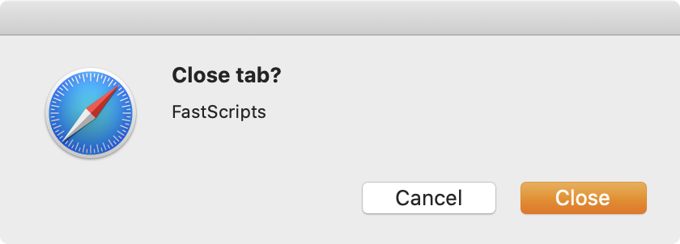

# AppleScripts for automating macOS

Inspired by John Gruber's post [Quit Confirmation for Safari on MacOS](https://daringfireball.net/2020/01/quit_confirmation_for_safari_on_macos) on [Daring Fireball](https://daringfireball.net/), I updated his Quit Confirmation and created a couple more.

I'm also using Red Sweater's [FastScripts](https://red-sweater.com/fastscripts/) script management utility to configure these scripts to run.

You can copy the `Applications` folder to your `~/Library/Scripts/` folder as a starting point if you have no other scripts or selectively copy just what you want.

## Safari

### Quit Confirmation
Made two small changes to Mr. Gruber's quit confirmation. 

1. If there are no open windows, don't confirm the quit.
1. Change prompt title to **Quit Safari?**

### Close Tab Confirmation

I didn't know I could add the functionality to Safari until Gruber's post, but I've wanted a speed bump on closing a tab for a long time. It's great to finally have it, but it's not for everyone.

If the current tab is **Favorites**, then there is no prompt.

## Chrome
Why only add a quit confirmation to Safari when you can turn off Chrome's annoying ⌘W long press and do it right!

### Quit Confirmation

